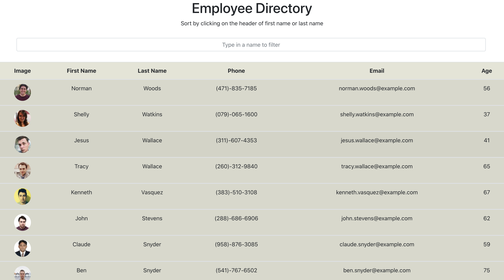

# Unit 19 React Homework: Employee Directory

## Overview

Employee Directory is created with React. Users are able to view my entire employee directory at once so that they can have quick access to their information.

The app will show a table of random users generated from the [Random User API](https://randomuser.me/), when the user loads the page, a table of 50 employees will render. 

The user is able to:
  * Sort the table by at least one category
  * Filter the users by at least one property.

## Table of Contents
* [Overview](#Overview)
* [Screenshots](#Screenshots)
* [Installation](#Installation)
* [Technologies](#Technologies)
* [Repository](#Repository)
* [Deployment](#Deployment)

## Screenshots
* [App](#public/screenshots/app.png)

#### Application Page
The screenshot of the application.

  

## Installation

* Copy all the application files locally to one's machine.
* Install all dependencies by running 

    * **npm install**

* Run the application by the following instructions in the terminal

    * **npm start**

The application will be listened on localhost:3000 in your browser URL line.

## Technologies

* React
* Heroku
* axios

## Repository

The link to the github repository is: https://github.com/lhaodev/employee_directory

## Deployment

The link to the deployed application is: https://lhaodev.github.io/employee_directory/